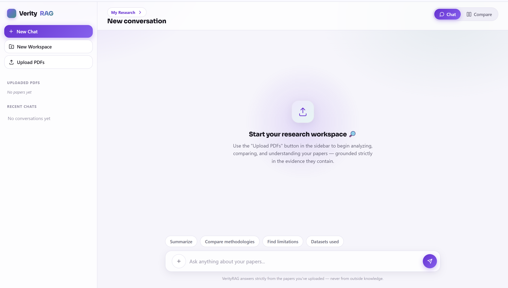

# VerityRAG

**An evidence-grounded research intelligence system that retrieves, analyzes, compares, and reconstructs knowledge from scientific literature.**

<p>
  
  
  
  
  
  
</p>

---

## Overview

**Verity** — truth, reliability. **RAG** — Retrieval-Augmented Generation.

VerityRAG is a research-paper workspace built around one constraint: **every
answer must trace back to the evidence the user actually uploaded.** Point it
at a stack of PDFs and it answers questions, compares methodologies across
papers, generates structured reports, quizzes you on the material, critiques
a paper's methodology, and maps out a document's concepts — all grounded in
retrieved passages, never in the model's general knowledge.

The problem it addresses is the one every "ChatGPT + PDF" tool runs into:
handed a stack of papers and a vague question, a bare LLM will confidently
blend memorized knowledge with document content, and there's no way to tell
which is which. VerityRAG's answer is architectural, not a prompt trick — a
hybrid dense + keyword retrieval pipeline picks the evidence, the model is
instructed to answer *only* from what was retrieved, self-reports whether
that evidence was actually sufficient, and a document explicitly says so
when the uploaded papers don't cover a question rather than filling the gap
from outside knowledge.

## Preview

<p align="center">
  
</p>

<p align="center"><em>The research workspace: per-workspace document management, persistent conversation history, and every research-intelligence action reachable from a single composer menu.</em></p>

---

## Key Features

Every item below is implemented in this repository — nothing here is aspirational.

| Feature | What it does |
|---|---|
| **Evidence-grounded PDF Q&A** | Answers are synthesized only from retrieved chunks of the currently active documents; outside knowledge is explicitly excluded by the prompt contract. |
| **Hybrid Dense + BM25 retrieval** | Semantic search (`sentence-transformers/all-MiniLM-L6-v2`) runs alongside BM25 keyword search so exact terms, model names, and dataset names aren't lost to pure semantic drift. |
| **Reciprocal Rank Fusion (RRF)** | Merges the dense and BM25 ranked lists (`RRF(d) = Σ 1/(k + rank(d))`, k=60) without needing score normalization. |
| **Cross-Encoder reranking** | A local `cross-encoder/ms-marco-MiniLM-L-6-v2` model re-scores the fused candidate pool — a real model forward pass, zero extra LLM calls. |
| **Deterministic query decomposition** | Multi-part comparison questions are split into sub-queries with pure pattern matching, not an LLM call. |
| **Strict document scoping** | Every request resolves an explicit, priority-ordered document scope (named-in-text → explicit "all" → selected → active); retrieval never silently spans documents outside that scope. |
| **Multi-paper comparison** | One structured-report call receives evidence from every selected paper grouped together — never one call per paper. |
| **Comparative reports** | Per-paper + cross-paper structured report, exported as Markdown, PDF, and DOCX from the same validated JSON — the LLM never touches file formatting. |
| **Viva / Mock Test / Project Interview** | Question generation and a turn-by-turn interview loop, grounded in the uploaded document's own evidence (not a generic quiz). |
| **Explain Figure** | Explains a referenced figure/table/graph from its extracted caption and surrounding text. |
| **Paper Evaluation** | A structured critique (problem clarity, novelty, methodology, results, limitations, reproducibility, strengths/weaknesses) with each dimension labeled by evidence support. |
| **Research Gap Discovery** | Surfaces gaps labeled `AUTHOR_STATED_GAP` (the paper says so) vs. `POTENTIAL_INFERRED_GAP` (reasonably inferred, never invented). |
| **Literature Matrix** | One row per paper across problem/method/architecture/dataset/metrics/results/limitations/gap — each cell grounded only in that paper's own evidence. |
| **Knowledge Graph** | Concept nodes/edges per document, with cross-paper edges only when the evidence itself supports a real relationship. |
| **Evidence-aware grounding** | Structured-mode responses can carry a claim-level trace (`DIRECTLY_STATED` / `STRONGLY_SUPPORTED` / `NOT_FOUND`) generated in the same call — no extra request. |
| **Token / LLM-call optimization** | Normal Q&A is exactly one LLM call on success; retrieval, reranking, decomposition, and evidence selection are all LLM-free. |
| **Caching, fallback & observability** | In-memory answer/report cache, a bounded one-time fallback model on genuine failures, and structured JSONL event logging for every request. |

---

## How It Works

```
PDF Upload
    ↓
PDF Parsing               (pypdf — page-aware text extraction)
    ↓
Chunking + Parent Context (page/section-aware, 800-char chunks, 100-char overlap)
    ↓
Embeddings                (sentence-transformers/all-MiniLM-L6-v2, 384-dim)
    ↓
ChromaDB                  (persistent vector store, metadata-filtered by document_id)
    ↓
Dense Retrieval + BM25    (parallel candidate pools, zero LLM calls)
    ↓
RRF Fusion                (rank-based merge, no score normalization needed)
    ↓
Cross-Encoder Reranking   (local model, picks the strongest ~5 chunks)
    ↓
Context / Token Budgeting (dedup, per-document diversity cap, global token cap)
    ↓
Grounded LLM Synthesis    (ONE call, Pydantic-validated structured JSON)
    ↓
Evidence-backed Answer
```

---

## Architecture

```
verityrag/
├── frontend/
│   └── index.html          Single-file UI — sidebar, chat, compare view, all
│                            research-action panels. Vanilla JS, no build step,
│                            no framework.
├── backend/
│   ├── main.py              FastAPI app — all HTTP endpoints
│   ├── ingest.py             PDF parsing → chunking → embeddings → Chroma
│   ├── retrieval.py           Dense + BM25 + RRF + Cross-Encoder rerank + token budgeting
│   ├── query_transform.py      Deterministic query decomposition + Groq call wrapper (primary/fallback)
│   ├── graph/                   LangGraph orchestration (normal + Deep Research modes)
│   ├── analysis.py                Viva/Mock Test/Interview/Explain Figure/Evaluate Paper/
│   │                               Research Gaps/Literature Matrix/Knowledge Graph prompts
│   ├── report_generator.py          Structured report generation + Markdown/PDF/DOCX rendering
│   ├── doc_titles.py                 Deterministic, LLM-free display-title resolution
│   ├── schemas.py                     Pydantic contracts for every LLM JSON output
│   ├── database.py                     SQLite registry — workspaces, documents, sessions, messages
│   ├── cache.py                         In-memory answer/report cache
│   ├── observability.py                  Structured JSONL event logging
│   └── chroma_store/                      Persistent ChromaDB collection (runtime data)
└── data/                                   Evaluation harness fixtures/results
```

**Frontend** — a single self-contained HTML file: sidebar (workspace switcher,
document list, conversation history), a chat pane, a side-by-side compare
view, and a grouped "+" actions menu for every research-intelligence
feature. No React/Vue, no bundler — open the file and it runs.

**Backend** — FastAPI. `main.py` is the HTTP surface; every request path
(normal Q&A, Deep Research, reports, and all `/analyze` modes) reuses the
*same* retrieval pipeline in `retrieval.py`, so grounding and scoping
guarantees hold everywhere, not just in the chat endpoint.

**Retrieval layer** — `retrieval.py` + `ingest.py`. Entirely deterministic
and LLM-free: embeddings, BM25, RRF, reranking, and token budgeting are all
plain Python/model inference, never a Groq call.

**LLM layer** — `query_transform.py` wraps every Groq call with a single
bounded fallback attempt (primary model → fallback model, once, only on a
genuinely temporary failure) and per-request call-count tracking. `graph/`
holds the LangGraph state machine that decides *when* that one call happens.

**Storage** — ChromaDB (`backend/chroma_store/`) for vectors, SQLite
(`data/registry.db`) for workspaces/documents/sessions/messages.

**Observability** — every request appends one structured line to
`logs/verityrag_events.jsonl` (LLM call count, fallback/cache status, token
counts, latency) — read back by `GET /eval/dashboard`, never surfaced in the
normal chat UI.

---

## Research Intelligence

Beyond Q&A, VerityRAG runs a set of structured analysis modes over the same
retrieved-and-reranked evidence — each one exactly one additional LLM call:

- **Evaluate Paper** — a fixed-dimension critique (problem clarity, novelty,
  methodology, experimental design, results, limitations, reproducibility)
  plus free-text strengths/weaknesses. Every dimension is tagged
  `DIRECTLY_STATED`, `STRONGLY_SUPPORTED`, or `NOT_FOUND` rather than being
  padded out when the evidence doesn't cover it.
- **Research Gap Discovery** — distinguishes gaps the authors state
  themselves from gaps that are only reasonably inferable from what *is*
  written, and labels each one accordingly.
- **Literature Matrix** — a comparison table with one row per selected
  paper; each cell is generated from that paper's own evidence block only,
  so a strong paper's results can't bleed into a weaker paper's row.
- **Knowledge Graph** — a concept tree for a single paper, or a
  cross-paper graph when multiple documents are selected, with every
  node/edge tagged with the document it came from.
- **Multi-paper comparison & reports** — one structured-report call covers
  every selected paper plus a dedicated cross-paper comparison section
  (commonalities, differences, strengths, limitations), exported to
  Markdown/PDF/DOCX.
- **Explain Figure** — explains a referenced figure, table, graph, or
  diagram from the surrounding extracted text and caption (see
  [Limitations](#limitations) — this is text-based, not a vision model).

---

## Interview & Learning Modes

- **Viva** and **Mock Test** — generate a batch of questions (with
  category, difficulty, and expected-answer points) directly from the
  uploaded document's evidence.
- **Project Interview** — a turn-by-turn interview loop: one question at a
  time, each candidate answer evaluated against the same evidence
  (correctness, missing points, suggested answer), with the next question
  generated from that same document — pinned to whatever document(s) were
  selected when the interview started, so the topic can't drift mid-session.

All three are PDF-grounded by default: they generate from the currently
selected uploaded document(s), not from any fixed or hardcoded subject
matter.

---

## Grounding & Reliability

- **Document scoping** — a single priority-ordered resolver decides which
  document_ids a request is scoped to (explicit request → named in the
  question text → an explicit "all documents" phrase → click-selected
  documents → all active documents) and every retrieval call is filtered to
  exactly that set.
- **Evidence grounding** — the synthesis prompt instructs the model to
  answer only from the retrieved evidence block and to say so when that
  evidence doesn't cover the question, rather than filling the gap from
  general knowledge.
- **Missing-evidence behavior** — when retrieval or the model determines
  the evidence is insufficient, the response says so explicitly instead of
  generating a plausible-sounding but ungrounded answer.
- **Self-reported confidence** — the same synthesis call returns `grounded`
  and `evidence_sufficient` booleans; there's no separate verifier call in
  normal mode, so this self-assessment costs nothing extra.
- **Claim support levels** — in structured mode, individual claims in the
  answer can be tagged `DIRECTLY_STATED` / `STRONGLY_SUPPORTED` /
  `NOT_FOUND` in that same call, for callers that want claim-level
  traceability rather than just a paragraph-level `grounded` flag.

**Stated honestly:** this is a system *designed* to minimize hallucination
through grounding, structured self-assessment, and explicit
insufficient-evidence handling — it does not claim to mathematically
guarantee zero hallucinations, which no LLM-based system can.

---

## Token & LLM Efficiency

- **One-call normal mode** — a standard question is exactly one physical
  LLM call on success (two only if the primary model has a genuinely
  temporary failure and the bounded fallback is used).
- **Deterministic processing everywhere else** — query decomposition,
  retrieval, RRF fusion, reranking, and document-scope resolution are all
  plain Python/local-model inference; none of them call an LLM.
- **Global context budgeting** — retrieved chunks are deduplicated, capped
  per document for diversity, and selected against a global token budget
  (`MAX_CONTEXT_TOKENS`) before anything reaches the model; output length
  is separately capped (`MAX_ANSWER_TOKENS`).
- **Reranking without an LLM** — the Cross-Encoder narrows ~30 fused
  candidates down to the final evidence set via a local model forward pass.
- **Bounded fallback** — the fallback model is tried at most once, and only
  for a classified-temporary failure (rate limit, 5xx, timeout, or the
  primary model being unavailable) — never for auth errors or bad input.
- **Deep Research is explicitly bounded** — the multi-step agentic path
  (planner, adaptive retrieval, cross-paper analysis, verification retry)
  is capped by `DEEP_RESEARCH_MAX_ITERATIONS` / `_MAX_LLM_CALLS` /
  `_MAX_RETRIES` so it can never run unbounded, even under a routing bug.
- **Caching** — an identical question against an identical active document
  set and conversation context is a full cache hit (zero LLM calls, zero
  retrieval); any upload or deletion invalidates the whole cache
  immediately.

---

## Tech Stack

| Layer | Technology |
|---|---|
| Backend framework | FastAPI, Uvicorn |
| Orchestration | LangGraph, LangChain Core |
| LLM provider | Groq (`llama-3.3-70b-versatile`, fallback `openai/gpt-oss-120b`) |
| Embeddings | sentence-transformers (`all-MiniLM-L6-v2`) |
| Reranking | sentence-transformers CrossEncoder (`cross-encoder/ms-marco-MiniLM-L-6-v2`) |
| Keyword search | rank-bm25 (BM25Okapi) |
| Vector store | ChromaDB (persistent client) |
| Relational storage | SQLite |
| PDF parsing | pypdf |
| Validation | Pydantic v2 |
| Report export | ReportLab (PDF), python-docx (DOCX) |
| Frontend | Vanilla HTML/CSS/JS — no framework, no build step |
| Testing | pytest, `unittest.mock` (Groq network-boundary mocking) |

---

## Project Structure

```
verityrag/
├── frontend/
│   └── index.html
├── backend/
│   ├── main.py
│   ├── config.py
│   ├── ingest.py
│   ├── retrieval.py
│   ├── query_transform.py
│   ├── analysis.py
│   ├── doc_titles.py
│   ├── report_generator.py
│   ├── schemas.py
│   ├── database.py
│   ├── cache.py
│   ├── observability.py
│   ├── verify.py
│   ├── llm.py
│   ├── eval_harness.py
│   ├── requirements.txt
│   ├── conftest.py              pytest isolation — temp Chroma/SQLite, never production
│   ├── test_*.py                 227 tests across ingestion, retrieval, the LangGraph
│   │                              workflow, analysis modes, scoping, caching, and eval
│   ├── tests/fixtures/             Test-only PDF fixture, isolated from the real workspace
│   ├── graph/
│   │   ├── workflow.py               StateGraph definition (normal + Deep Research)
│   │   ├── state.py                   Shared ResearchState TypedDict
│   │   ├── planner.py                  Deep Research: query planning
│   │   ├── retriever.py                 Deep Research: adaptive retrieval node
│   │   ├── organizer.py                  Evidence grouping (shared by all modes)
│   │   ├── synthesizer.py                 The one-call synthesis node
│   │   ├── analyzer.py                     Deep Research: sufficiency/cross-paper analysis
│   │   └── verifier.py                     Deep Research: claim verification pass
│   └── chroma_store/                        Persistent ChromaDB collection (runtime data)
├── data/
│   ├── registry.db                            SQLite registry (runtime data)
│   ├── eval_set.json                            Offline evaluation questions
│   └── eval_results_comprehensive.json           Offline evaluation results
├── docs/images/
│   └── verityrag-ui.png
└── logs/
    └── verityrag_events.jsonl                      Structured event log (runtime data)
```

---

## Installation & Setup

```bash
git clone https://github.com/tanyaverma20/VerityRAG.git
cd VerityRAG/backend
pip install -r requirements.txt
```

Create a `.env` file inside `backend/` (never commit this file — it's
already covered by `.gitignore`):

```bash
# Required
GROQ_API_KEY=your_groq_api_key_here

# Optional — these already have sensible defaults in config.py
GROQ_MODEL=llama-3.3-70b-versatile
GROQ_FALLBACK_MODEL=openai/gpt-oss-120b
CHROMA_DIR=./chroma_store
RERANKER_MODEL=cross-encoder/ms-marco-MiniLM-L-6-v2
COLLECTION_NAME=verityrag_docs_v2
```

The reranker and embedding models are downloaded automatically from
Hugging Face on first run.

## Running Locally

**Backend:**

```bash
cd backend
python -m uvicorn main:app --host 127.0.0.1 --port 8001
```

Confirm it's up:

```bash
curl http://127.0.0.1:8001/health
# {"status":"ok","chunks_indexed": <N>}
```

**Frontend:**

Open `frontend/index.html` directly in a browser — it's a static file with
no build step. Upload a PDF from the sidebar, wait for it to reach "Ready,"
then ask a question.

---

## Testing

```bash
cd backend
python -m pytest --ignore=test_eval.py -q
```

The suite is 227 collected tests, split by dependency on real network calls:

- **~203 tests** (everything except `test_eval.py`) run against an isolated,
  temp-directory Chroma/SQLite environment set up automatically by
  `conftest.py` — the real `backend/chroma_store` and production
  `data/registry.db` are never touched. Most LLM-dependent assertions mock
  `groq.Groq` at the network boundary, so exact physical call counts are
  *proven*, not assumed (see `test_llm_call_count.py`,
  `test_analysis_modes.py`). Retrieval, reranking, and scoping assertions
  run against real (test-fixture) Chroma data — only the LLM call itself is
  mocked.
- **`test_eval.py`** (~24 tests) exercises the pipeline against the real
  Groq API and is run deliberately, not as a routine check, to avoid
  burning API quota.

Latest full run of the mocked/isolated suite: **202 passed, 1 pre-existing
failure** (a stale test double missing a field added by later workspace
support — unrelated to retrieval or grounding logic).

## Evaluation Harness

`backend/eval_harness.py` benchmarks naive / dense-only / hybrid+reranked
retrieval variants against `data/eval_set.json` and reports precision@5,
recall@5, and MRR per variant (`data/eval_results_comprehensive.json`) —
this is what backs the "hybrid retrieval improves recall/precision over
dense-only" claim with actual numbers instead of an assertion. The same
numbers are surfaced live in the app's **Eval Dashboard**
(`GET /eval/dashboard`), alongside real per-request metrics pulled from the
observability log (LLM calls/query, latency, cache hit rate, fallback
rate) — it explicitly reports `groundedness` and `hallucination_rate` as
**not measured**, rather than inventing a number for them.

---

## Example Use Cases

Upload one or more papers, then ask things like:

- *"What problem is this paper trying to solve?"*
- *"Summarize the methodology section."*
- *"Compare the methodologies of these two papers."*
- *"What datasets were used, and what were the reported metrics?"*
- *"What are the stated limitations?"*
- *"Explain Figure 2."*
- *"Which approach would you choose and why?"* (after comparing papers)

Or reach for a structured mode from the composer's actions menu: **Evaluate
Paper** for a critique, **Find Research Gaps** for what's missing,
**Literature Matrix** to line up several papers side by side, **Knowledge
Graph** to see a paper's concepts as a graph, or **Viva** / **Mock Test** /
**Project Interview** to be quizzed on the material.

---

## Design Decisions

- **Dense + BM25, not dense-only** — semantic search alone loses exact
  terms: model names, dataset names, acronyms, and numbers. BM25 catches
  precisely what embeddings blur.
- **RRF over a weighted score merge** — dense and BM25 scores live on
  different, incomparable scales. RRF combines rank positions instead of
  raw scores, so it needs no tuning or normalization step.
- **Cross-Encoder reranking after fusion, not before** — a Cross-Encoder is
  far more accurate than bi-encoder similarity but expensive (one forward
  pass per candidate). Running it only on the ~30 already-fused candidates,
  rather than the full corpus, keeps quality high and cost bounded.
- **ChromaDB** — a persistent, embeddable vector store with native metadata
  filtering, which is exactly what document-scoped retrieval needs (filter
  by `document_id` at query time) without standing up a separate service.
- **LangGraph** — normal mode is a straight line
  (plan → retrieve → organize → synthesize → assign_confidence), but Deep
  Research genuinely branches and loops (adaptive retrieval, cross-paper
  analysis, a bounded verification retry). A state graph makes that
  explicit and inspectable instead of a tangle of conditionals.
- **Structured, Pydantic-validated outputs** — every LLM response is
  parsed against a schema; a malformed response is a clean, typed failure
  path, never a silent `dict.get()` guess.
- **Token/context budgeting** — a global budget with a per-document cap
  means adding more papers to a comparison degrades gracefully (broader
  but still-representative coverage) instead of the prompt silently
  exceeding the model's context window.
- **Document scoping as a first-class concept** — every feature (Q&A,
  reports, viva, interview, comparison, evaluation) resolves scope through
  the same priority-ordered rule, so "which papers is this answer actually
  about" is never feature-specific or accidental.

---

## Limitations

Stated plainly, not as a footnote:

- **No automated groundedness/hallucination scoring in production** — the
  app reports live operational metrics (LLM calls/query, latency, cache
  hit rate) and offline retrieval-quality metrics (precision/recall/MRR),
  but has no automated scorer wired in for groundedness or hallucination
  rate; the Eval Dashboard says so explicitly rather than fabricating a
  number.
- **Explain Figure is text-based, not true visual understanding** — PDF
  parsing extracts text only (no page-image rendering or vision model in
  the pipeline). Figure/table explanations come from the caption and
  surrounding extracted text, and the response says so — it does not claim
  to have visually inspected the image.
- **PDF text extraction quality depends on the source PDF** — scanned
  (image-only) PDFs with no embedded text layer, or PDFs with unusual
  layouts/columns, will extract poorly or not at all; there's no OCR step.
- **Single shared vector collection** — document isolation is enforced by
  `document_id` metadata filtering plus a SQLite workspace registry, not by
  a separate Chroma collection per user/workspace; this is adequate for a
  single-tenant/personal-scale deployment, not multi-tenant production
  isolation.
- **In-memory cache, single process** — the answer/report cache is a
  process-lifetime dict, not a distributed cache; it resets on restart and
  doesn't share state across multiple backend instances.
- **No streaming output** — answers are returned in full, not
  token-by-token.

## Future Improvements

- Genuine visual figure/table understanding via page-image extraction and a
  vision-capable model, with the current text-based explanation kept as an
  honest fallback when that's unavailable.
- An automated groundedness/hallucination scorer wired into the live Eval
  Dashboard, replacing the current "not measured" fields with real numbers.
- Per-tenant vector store isolation for multi-user deployment.
- Streaming token-by-token responses for perceived latency.

---

## Author / Project

**VerityRAG** — an evidence-grounded research intelligence system, built to
demonstrate that a RAG pipeline's reliability comes from its retrieval and
scoping architecture, not just its prompt.

Repository: [github.com/tanyaverma20/VerityRAG](https://github.com/tanyaverma20/VerityRAG)
